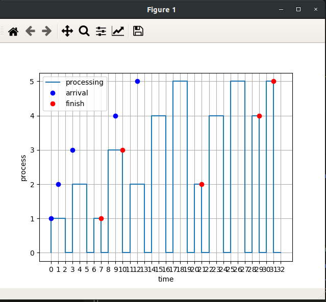

# OS-Scheduler

OS-Scheduler simulator supporting Round Robin (RR), First Come First Serve (FCFS),  
Highest Priority Firts (HPF) and Shortest Remaining Time Next (SRTN)

## Required Packages
1. `tabulate`
2. `numpy`
3. `matplotlib`

## How to run
`python Process_Generator_Module.py <input_file> <output_file>`  
`python main.py <input_file> <algorithm> <context_switching_time> <time_quantum>`  
Note: time_quantum is only required for Round Robin algorithm

## Process_Generator_Module
It generates a file containing processes described by process number, arrival time,  
burst time and priority. The arrival and burst time follow normal distribution,  
while priority follows poisson distribution.

The input file contains:
1. number of processes to generate
2. Mu and Sigma of Arrival time distribution
3. Mu and Sigma of burst time distribution
4. Lambda of priority distribution

[Input file example](input.txt)  
[Output file example](generator_samples/processes1.txt)

## Scheduler
### 1. Input
   1. Input file name that contains the processes information as described above
   2. Algorithm (RR, FCFS, HPF, SRTN)
   3. Context switching time
   4. Time quantum
   
### 2. Output
   1. Visual graph that shows the generated schedule.  
   The x-axis represents the time while the y-axis represents process number.  
   The following example corresponds to the [input file](user_samples/test1.txt) with  
   RR algorithm, context_switching_time = 1 and quantum = 2  
   

   2. Text file containing the following metrics for the generated schedule:
      1. Waiting time of each process.
      2. Turnaround time of each process.
      3. Weighted Turnaround time of each process.
      4. Average Turnaround time of the schedule.
      5. Average Weighted turnaround time of the schedule.  
   
        [Output file](user_samples/test1_RR_metrics.txt) for the above given input
